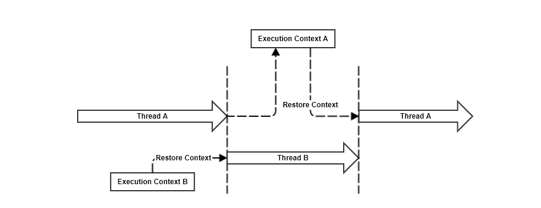
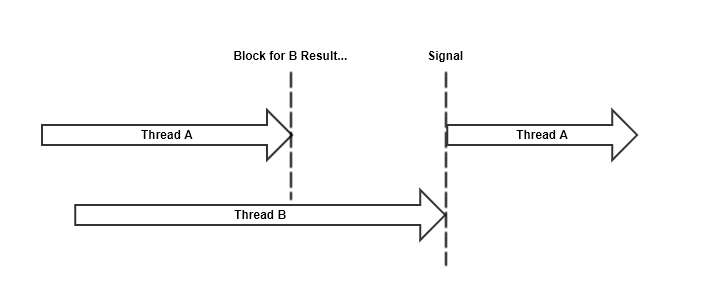
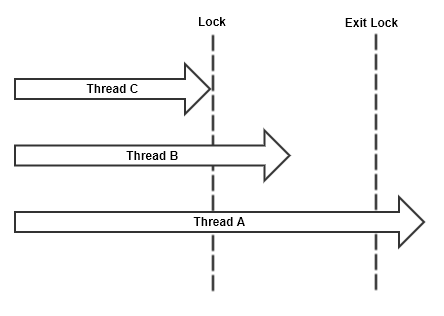

It's 4:30pm on a Thursday in Spring 2005 and I'm slouched down in swivel chair on a row all to myself. The subject was CS 320: Operating Systems, and despite the auditorium style classroom in McAdams Hall being suited for a few hundred students, there were only twelve of us in attendance. Dr. Madison, unfazed by our existance, or lack thereof, robotically scribbled notes across the dry erase board. At this point in my college career, note taking had become a visceral motor function similar to breathing. I had become a master at suppressing hangover symptoms, sweeping for mines with my free hand, and considering my plans for that night all while perfectly mapping the dry erase board to an easy-to-digest layout on my stationery. I would hold onto these notes for weeks, consume them just before an exam, usually post a **C**, and retain less than five percent of what I "learned." This cycle of "Operating Systems" knowledge was acceptable in my naive and completely warped sense of "real world software." 

> "I'm never going to build an Operating System, so `<bullshit excuse>`." - Matt Bolt, 2005
{: .boltquote}

Over the years, I've become _slightly_ wiser, a bit more experienced, and in retrospect, it may be easy to find irony in the fact that "...of course OS knowledge is useful Matt, you idiot...," it's not what led me to recount this day 14 years ago. I remember quite specifically that the lecture Dr. Madison was giving that day was on scheduling. It started with the basic description of scheduling policies, and quickly advanced into avoiding issues like resource starvation. I found it fascinating that our single core PCs at the time had created the illusion of executing tasks in parallel. What appeared to be simultaneous execution of tasks was an intelligent use of scheduling.

This post is going to focus on the illusion of parallelism via concurrency, the effects of resource starvation, and look at some of the ways scheduling and architecture can assist in maximizing concurrency. We'll then apply this knowledge to the application domain in order to analyze the current modern day approaches to task/thread scheduling. 

### Operating System Scheduling
Sometimes it's easy to forget that our programs aren't executed "as-is" on hardware. With many modern day languages, we have battle tested virtual machines between our code and the operating system. Runtimes like the JVM and CLR are highly optimized for each operating system and CPU architecture they run on, which abstracts away the aggrevating nuances that would typically plague cross-platform applications. The file system has a generic set of APIs that can be used on OSX or Windows, network IO libraries capable of similar high speed performance on Android and CentOS, and APIs for interoperability used for use-cases not covered by the generic platform APIs.

> Given that scheduling is such a huge part of an operating system, we can easily leverage the benefits of the host scheduling in our software, right? 

We absolutely can, but we can go one step further and provide specific information about the units of work performed by our application. When the host scheduler provides our application CPU resources it can utilize it's own task scheduling. It can arrange tasks in a way such that it influences future resource allocation by the host scheduler for the application's process.

Just to give you an idea of an Operating System scheduler, many modern day operating systems are based on an algorithm that is nearly 60 years old:

#### Multilevel Feedback Queue
First developed by [Fernando J. Corbató](https://en.wikipedia.org/wiki/Fernando_J._Corbat%C3%B3) in **1962**. This algorithm leverages multiple First-In, First-Out (FIFO) queues with the following operations:
* New processes are queued on the top level queue.
* When the process reaches the head of the queue, it is assigned the CPU.
    * Process Completes in a specific time frame, it terminates.
    * Process releases CPU control voluntarily, it is removed from current queue until it requests CPU again.
    * Process uses all of it's allocated CPU resource, it's queued on a lower tier queue.
* The above cycle continues until process reaches the lowest tier queue or terminates. 
    * Lowest tier queue allocates resources using a round robin policy.
    * Blocking for IO promotes the process to a higher tier queue.
    * Excessive wait times for CPU resources will also promote the process to a higher tier queue.

This algorithm prefers short tasks and prioritizes IO bound processes. Each process is directed to a specific queue based on the amount of resource time used.

There are, of course, many more complexities dealing with modern day operating systems and CPU architectures, but in the context of this post, we'll focus on the above logic as a primer, and a gateway into the preemptive nature of threads.

### Application/Process Task Scheduling
Similar to the way the Operating System manages processes and kernel threads, our application has it's own shared memory and local threads. When the host scheduler grants our application CPU resources, we're free to tell the scheduler how to best use the CPU. In other words, our application has the ability to schedule specific tasks to best utilize the CPU resources when they are acquired. 

#### Threads
Application threads share memory with the rest of the application, but they have their own stack and _Program Counter_ also known as the _Instruction Pointer_. There are typically two types of threading models:
* Cooperative: Once a thread is given control, it continues to run until it explicitly yields or blocks.
* Preemptive: Scheduling is allowed is preempt execution of a thread.
    * A higher priority thread needs to run.
    * The current thread has used up it's allocated time slice.

It should be obvious by now that our OS scheduler is _preemptive_, so our application will have the same capabilities. Some virtual machines may have specific threading policies that differ from the host scheduling. This is worth nothing, but won't necessarily apply to the examples in this post. 

#### Context Switching
Whenever a thread's execution is preempted, it's execution state is stored so that when it resumes execution, the state can be restored. The act of switching from one thread's execution to another is called `Context Switching`. There is generally a bit of overhead associated with context switching, but without it, single core multitasking machines would have never been possible. 



#### Blocking
Blocking is a thread's ability to halt execution or _wait_ for some condition to be met. For example, concurrently executing threads may require access to specific shared memory resources, or require the existance of a resource before continuing. `Blocking` allows a thread to halt it's execution, enter a _Parked_ state where the scheduler will ignore it when considering allocating CPU. When the required resource is available for thread consumption, it is woken up via a _Signal_, a type of interupt that will change the thread state back to running.



Blocking does preempt the thread causing the execution context to be stored. However, signalling will update the thread state to running. In order for context to be restored, the CPU must switch context back to `Thread A`. 

#### Locking
Locking is used to protect a shared memory resource from being accessed by multiple threads concurrently. While it is possible that locking will cause another thread to [`Block`](#Blocking), the two are not synonymous. There are also implementations of locks that poll the availability of the resource while mintaining CPU control, ie: `SpinLock`. 



* Threads `A`, `B`, and `C` all attempt to acquire a lock simultaneously. 
* Thread `A` acquires the lock. 
    * Thread `B` blocks or spins.
    * Thread `C` blocks or spins.
* Thread `A` releases the lock. 
    * Threads `B` and `C` attempt to acquire the lock.
* Thread `B` acquires the lock. 
    * Thread `C` blocks or spins.
* Thread `B` releases the lock.
    * Thread `C` attempts to acquire the lock. 
* Thread `C` acquires the lock. 

----
#### Potential Pitfalls
So far, we've laid down a whole lot of _how_ without much commentary. Most of the above diagrams have been used as a justification of shared memory and locking in concurrent programming for years. Each absurdly simple example is written in a vacuum and is easy to understand. It really pushes the _Object Oriented_ approach to threading where a thread is a stateful object capable of executing work. But...

> This is SPARTA?

Just cutting straight to the point, these diagrams illustrate nicely sandboxed handling for a few threads, but it's obvious they don't scratch the surface of real world use cases. I do think you should strive to reduce concurrency problems to their simplist form, but how? How do we take complex interaction between data structures and reduce it to simple terms of concurrency? 

#### Thread Starvation
Thread starvation can occur when you have many threads blocking to consume a specific resource. Since multiple blocking threads can reacquire a lock in any order, most of the time, this leaves other threads unable to acquire the resource. The best way to demonstrate this behavior is via example. I've written a fairly basic example in C# here: [ThreadStarvation.cs](https://gist.github.com/mbolt35/60b467f7698b74bd122baefd16ae1ca1)

> **Note** Concerning C# blocking via `Monitor.Wait`: It appears that using `Monitor.Pulse` with multiple blocking threads uses a fairness policy that will allow all blocking threads an equal chance to reacquire the lock. You can test this out in the provided example by chaning `PulseAll` to `Pulse` on line #172. We use `PulseAll` in our test to force all threads to unblock and block again preventing the fairness policy from being used.
{: .notequote}

Using the provided code, I tested with 40 consumer threads, a single producer, and ran for a minute. The results were as follows:
* Highest Consumptions: 16
* Lowest Consumptions: 8
* Mean: 12.15

There were two threads which were only able to consume the resource 8 times. This result will likely change based on CPU cores, and Operating System, but we can see that just increasing contention will alter thread efficiency. Blocking threads can be a waste of a resource. Those threads can actually be used elsewhere instead of being kept in a blocking state. This adds another "nice to have" feature to our list of how to make concurrency better: **Efficient use of thread resources.**

#### Implicit Violation of Encapsulation

In my experience, another concurrency problem stems from a standard OO practice: _encapsulation_. Object oriented languages use encapsulation to allow developers to better control dependencies, and for the most part, it does what it's supposed to do if used properly. However, threads _can_ work against the rules of encapsulation in a more implcit way. The work that a thread performs can include multiple independent objects, so you must consider other object interactions. For instance, `Object A` blocks waiting for an external resource, which slows down the rate at which `Object B` consumes data from `Object C`. Both `A` and `B` are independently operating objects, but because their work exists on the same thread, there exists an implicit dependence. It's often the case that concurrency management requires _adding_ dependencies between objects to better manage flow with the use of concurrency primitives. 

---

### Scheduling

Revisiting our [last post](../2019-06-30-the-road-to-better-concurrency-part1/), we saw that there are lots of concurrency primitives available in programming languages for managing how tasks are executed, but they can be difficult to use. We also discussed how flow control can assist in writing code serially even if tasks are asynchronous. Based on our knowledge of operating system schedulers, processes, and threads, how do we implement a scheduler that abstracts away the complexities of concurrent operation synchronization and provides flow control so developers can write naturally ordered code?

In my opinion, there are two approaches that standout as primary solutions:
* **Coroutines**: A generalization of a `Cooperative` threading model over the existing preemptive system. This approach can be considered synonymous with `Fibers`, although I tend to think about `Fibers` being an implementation of `Coroutines`.
* **Software Transactional Memory**: A concurrency control that avoids concurrent shared memory access by applying reads and writes to a snapshot of memory at a given moment(transaction). Intermediate memory states are not visible to other transactions, and because it doesn't access shared memory concurrently, it can be implemented lock free.

### Coroutines
We talked earlier about _encapsulation_ being difficult to maintain after sprinkling asynchronous behavior over the top of a well-written modular program. Executing operations on a thread creates an implicit relationship between all objects which might perform work during execution. Solutions involve adding explicit code dependencies to better manage the flow of data through the application. **Coroutines** provide a solution that resolves the data flow issue by allowing each phase of work to be separated into distinct operations. 

> Kind of like `Promises` you talked about last time?

The terminology here can be somewhat fuzzy, but for the sake of consistency, let's consider **coroutines** as the abstraction, and `Promises` as an implementation enhanced by hooks that provide flow control. For an object oriented language, this means you can maintain _encapsulation_, manage asynchronous operations serially, and move from one operation to the other without explicit dependence. 

Promises aim to remove the developer's concern of which thread is executing/blocking by scheduling units of work intelligently, assigning the work to threads. If the unit of work needs to **wait** for a resource, the thread does **NOT** block. Instead, it becomes available to host other work on. When the resource is available, another thread (or the same thread) can pick up where the **wait** started.

Let's dive into some examples with `C#`, a language that has done a fairly good job and implementing coroutine promises represented by the `Task<T>` class using the `async` and `await` syntax. 

> **Note** The intricacies of the .NET Core `TaskScheduler` implementations won't be covered in depth here, as that's a great topic for another post (or series of posts). We **will** cover the results of the scheduling, and how that applies specifically to our discussion of concurrency.
{: .notequote}

----

## C# Tasks

There are two flavors of this class, `Task`, and `Task<T>` which should be fairly self explanatory. The templated version, `Task<T>`, contains a return value while `Task` does not. 

To create a running task, you have a few options:
```csharp
// Create a new task t1, and start running the task
var t1 = new Task(() => Console.WriteLine("I'm a task!"));
t1.Start();

// Create and start a new task
var t2 = Task.Run(() => Console.WriteLine("I'm also a task!"));

// Create and start a new task
var t3 = Task.Factory.StartNew(() => Console.WriteLine("Another task!"));

// An async method/delegate -- note the async keyword 
// More about this in the examples
Func<Task> asyncDelegate = async () => Console.WriteLine("Last task example!");
var t4 = asyncDelegate();
```

If you run the above code in a method, you might be surprised that each `WriteLine` call might appear out of order. It's important to remember that scheduling tasks can happen across multiple threads (or no threads at all), which may cause tasks created at similar times to execute in different orders. If we add a property that would return the current managed thread id for each console output, you may see something like this:
```
[Thread Id: 3] I'm a task!
[Thread Id: 1] Last task example!
[Thread Id: 4] Another task!
[Thread Id: 5] I'm also a task!
```

Tasks also have instance methods and properties for working directly with them.

```csharp
// Create and start a new task
var t3 = Task.Factory.StartNew(() => Console.WriteLine("Another task!"));

// This BLOCKS the current thread until completion. 
t3.Wait();
```

For `Task<T>`, the `Result` property is similar to the `Wait()` call, but returns the `T` value:

```csharp
// Create and start a new task
var t3 = Task.Factory.StartNew<int>(() =>
{
    Console.WriteLine("Another task!"));
    return 25;
};

// This BLOCKS the current thread until completion. 
int result = t3.Result;
```
<p/>
> Hold up a second. So creating a task schedules the action to run on potentially another thread, multiple tasks can execute out of order, and calling `Wait()` will block the calling thread. **This doesn't sound anything like Coroutines.**

That's right because we've only covered the scheduling component. If the language only provided `Task`, we wouldn't have much more than a `ThreadPool.` In fact, the default `TaskScheduler` for .NET Core is: `System.Threading.Tasks.ThreadPoolTaskScheduler` which is a fairly light adapter.

It's also important to note that if any of these tasks had dependencies between them, we would be in a lot of trouble since the order is somewhat random. To introduce flow control, `ContinueWith` allows you to continue a task with a callback method. Calling `ContinueWith` will return a `Task` representing the new continuation. 

```csharp
var t3 = Task.Factory.StartNew(() => Console.WriteLine($"[{Tid}] Task t3"));
var t3Continuation = t3.ContinueWith(t => Console.WriteLine($"[{Tid}] After t3!"));
```

This orders the `ContinueWith` parameter to execute after `t3`. If you test this yourself, did you notice anything unexpected about the `Thread Id`? 

> Yeah, the continuation action executed on the same thread as the task. So, we can assume...

Nope! Just because you observe specific thread scheduling doesn't imply any sort of scheduling semantics. Try the same example again, but add more tasks and continuations.

This code running on my machine:

```csharp
/// <summary>
/// The current thread id.
/// </summary>
private string Tid => Thread.CurrentThread.ManagedThreadId.ToString();

// ...

// Create a new task t1, and start running the task
var t1 = new Task(() => Console.WriteLine($"[{Tid}] Task t1"));
t1.Start();
t1.ContinueWith(t => Console.WriteLine($"[{Tid}] After t1!"));

// Create and start a new task
var t2 = Task.Run(() => Console.WriteLine($"[{Tid}] Task t2"));
t2.ContinueWith(t => Console.WriteLine($"[{Tid}] After t2!"));

// Create and start a new task
var t3 = Task.Factory.StartNew(() => Console.WriteLine($"[{Tid}] Task t3"));
t3.ContinueWith(t => Console.WriteLine($"[{Tid}] After t3!"));

// An async method/delegate -- note the async keyword 
// More about this in the examples
Func<Task> asyncDelegate = async () => Console.WriteLine($"[{Tid}] Task t4");
var t4 = asyncDelegate();
t4.ContinueWith(t => Console.WriteLine($"[{Tid}] After t4!"));
```

Gave me the following results:

```
[5] Task t3
[1] Task t4
[3] Task t2
[4] Task t1
[6] After t3!
[5] After t4!
[8] After t2!
[4] After t1!
```

The point being that the scheduler will leverage a thread pool to maximize concurrency across the executing tasks. However, the idea is to get away from thinking about thread context. We should be considering tasks as executing work and not where or how it's being executed.

> Ok, so we'll use our knowledge of task schedulers to relate the model to a pure object oriented threading mdoel, but in general, we should focus more on scheduling tasks meaningfully to perform the work in our program. This seems difficult given that the scheduler will just throw tasks on different threads. 

With regards to the scheduler component, we mentioned that C# implements **Coroutines** as a task scheduler _AND_ flow control. The `Task` class is all about scheduling, the `async` and `await` syntax provides flow control for the scheduler.

#### Async and Await
This is an excerpt from the first real example we'll dive into soon. For now, let's ignore the program logic and focus on the syntax and code structure.

```csharp
public async Task<int> GetTotalWords(string url, int wordLength)
{
    // Get the string contents of a url
    string urlContents = await DownloadTextFile(url);

    // Find the total number of words with length >= wordLength
    int totalWords = await TotalWordsIn(urlContents, wordLength);
    return totalWords;
}
```

Let's focus on what's going on here from the developer's standpoint, starting with the syntax. The `async` keyword is a flag that tells the compiler that we plan on using `await` to handle asynchronous tasks. 

> So to use `await`, we must use the keyword `async` in the signature of a method?

That's correct. Without going too far down the rabbit hole, the `async` keyword tells the compiler to generate a state machine object. 

The `await` keyword tells the current task to yield until the method completes before continuing to the next line of code. The return type of this method is `Task<int>`. 

> Is `await` synonymous with the `Wait()` method from the previous section? You know, the one that blocks?

It is not the same at all. The `await` keyword is is used to yield control of the current execution context. It denotes a possible asynchronous action that no longer needs to run and will send a notification later when it's time to resume. `Wait()` is implemented using a `WaitHandle` which will block the current thread until the handle is signalled (Pulsed in C#).

#### Async State Machine

We mentioned earlier that when the `async` keyword is used, the compiler will generate a state machine object for that method. This state machine is designed to leverage the existing scheduling APIs in a way the maintains order and flow control in your code. Each state machine contains multiple states, separated by locations where `await` is used. If you recall in the section on `Task`, we discussed the utility method: `ContinueWith`. The async state machine the compiler generates incorporates task based await logic that continues by calling the state machine's `Next()`. For example, the following:

```csharp
void Dinner() 
{
    await GatherIngredients();
    var cookTask = CookIngredients();
    PrepareDessert();
    await cookTask;
    await ServeAndConsumeDish();
    ServeDessert();
}
```

The generated state machine will look something like this (pseudo code):

```
class DinnerStateMachine 
    state = 0

    void Next()
        state 0:
            state = 1
            task = GatherIngredients()
            task.ContinueWith
                Next()
        
        state 1: 
            state = 2
            task = CookIngredients()
            PrepareDesert()
            task.ContinueWith
                Next()
        
        state 2:
            state = 3
            task = ServeAndConsumeDish()
            task.ContinueWith
                ServeDessert()
                Next()

        state 3:
            NotifyComplete()
```

This is a _very_ simplified view of the compiler generated code, but it should give you an idea of how flow control takes shape provided the scheduling. 

> **Note**: Notice how `CookIngredients()` stored it's `Task` in a variable, then ran `PrepareDessert()`. The behavior can potentially run both concurrently. The continuation (via `await`) isn't added until after `PrepareDessert()`.
{: .notequote}

----

#### Counting Words Example

At this point, we've covered enough of the basics to formulate some ideas around how these features improve concurrency APIs. Let's continue the example above by implementing the missing pieces. 

This example will download a text file asynchronously and then count the total number of words that are of a specific length or longer. Let's start out testing against a single text file and move towards processing multiple files concurrently. Let's go ahead and look at the code from last section along with the C# program entry point:

```csharp
using System;
using System.IO;
using System.Linq;
using System.Net;
using System.Text;
using System.Threading;
using System.Threading.Tasks;

// Our main class
public class Program 
{
    // Entry Point
    public static void Main(string[] args)
    {
        var demo = new TaskDemo();

        // Note that we explicitly call Wait() on the Task that Run returns. 
        // Depending on what specific version of .NET, you may not be allowed 
        // to use async in the Main method, so we'll compromise here with the 
        // blocking Wait(). If you didn't block here, the program would end 
        // immediately.
        try 
        {
            demo.Run().Wait();
        } 
        catch(Exception e)
        {
            Console.WriteLine($"Caught an exception running demo: {e}");
        }

        // Another blocking call which waits until we press ENTER
        Console.WriteLine("Press [ENTER] to quit...");
        Console.ReadLine();
    }
}

// Task Demo Class - Core logic for our program.
public class TaskDemo
{
    // Empty Constructor
    public TaskDemo() { }

    // This method runs the task demo. Notice that we use our async keyword and 
    // return a Task type. Because we used the async keyword, we can freely use
    // await in the scope of the method.
    public async Task Run() 
    {
        // The url of a fairly large text file, and a variable representing the
        // minimum word length requirement when counting total words in the text.
        var textFileUrl = "https://norvig.com/big.txt";
        var minWordLength = 10;

        // Execute the GetTotalWords providing the url and min word length requirements
        // await the task
        int totalWords = await GetTotalWords(textFileUrl, minWordLength);

        // when the task completes, we can print the results
        Console.WriteLine($"Total Words Found: {totalWords}");
    }

    // The async method to get the total words. When we use the async keyword and 
    // Task<int>, we'll return an int, not a task. 
    public async Task<int> GetTotalWords(string url, int wordLength)
    {
        // Get the string contents of a url
        string urlContents = await DownloadTextFile(url);

        // Find the total number of words with length >= wordLength
        int totalWords = await TotalWordsIn(urlContents, wordLength);
        return totalWords;
    }

    // ...
}
```

To briefly run through this, we've basically written the typical `public static main` boilerplate used in Java and C# for our application. The `main` method will create a new `TaskDemo` instance, execute `Run()` and then block until it receives results. 

We've designed our basic demo entry point, a method that performs two tasks where it must
wait on the first task (downloading the text file) before it can count the number of words. Starting with downloading the text file, we're awaiting a string result, so the method must return a `Task<string>`. 

```csharp
public async Task<string> DownloadTextFile(string url);
```

It turns out that most of the C# standard libraries have implemented async versions of common synchronous utilities. Fortunately for us, it makes downloading a text file easy:

```csharp
public async Task<string> DownloadTextFile(string url);
{
    // We use the System.Net.WebClient to perform the download
    using (var client = new WebClient())
    {
        // Download the binary as a byte[] - await the result!
        byte[] bytes = await client.DownloadDataTaskAsync(url);

        // Convert the binary to an ASCII encoded string and return
        // Note that we return a string here -- similar to how await transforms
        // the result to the T-type
        return Encoding.ASCII.GetString(bytes);
    }
}
```
The next method we require accepts the contents of the text file and the minimum word length and performs a word count. Here is the signature for `TotalWordsIn()`:

```csharp
public Task<int> TotalWordsIn(string contents, int wordLength);
```

If you noticed, this method returns a `Task<int>`, but it's missing the `async` keyword in the signature. 

> This is fine though, right? It just means that we can't use the `await` keyword in the method. 

Correct on both counts, although we need to take a closer look to see why this method is different than the others. Let's consider what this method should be doing:

1. Take the string contents parameter and break it apart into words. 
2. Examine each word to see if it meets the length requirement.
    * If it is `>= wordLength` increment a count.
    * If it is `< wordLength` do nothing.
3. Return the total count.

Let's assume that the C# standard libraries don't provide an awaitable API for any of the steps we listed above. This changes how we approach a solution to this problem. We now have to determine how to best break this problem into smaller asynchronous tasks. One of the conveniences we've mentioned multiple times in this post is that flow control lets us write code that reads synchronously, so I like to start by writing a synchronous version of the logic and work backwards.

So let's write a synchronous implementation, then wrap the logic in `Task.Factory.StartNew` and return that. This is certainly not an optimal solution, but we need to ensure that we can run the program to test our logic, then we can look for optimization opportunities. 

```csharp
private static int TotalWordsOfLength(string text, int wordLength)
{
    var index = 0;
    var count = 0;

    // Skip all whitespace characters
    while (index < text.Length && char.IsWhiteSpace(text[index]))
    {
        index++;
    }

    // Loop until all characters are consumed
    while (index < text.Length)
    {
        // Store the current index
        var lastIndex = index;

        // Loop until we reach the end of the text are find a white space character
        while (index < text.Length && !char.IsWhiteSpace(text[index]))
        {
            index++;
        }

        // Examine the length of the current index minus the starting index
        // Increment the count if the length meets the requirement.
        if (index - lastIndex >= wordLength)
        {
            count++;
        }

        // Skip whitespace
        while (index < text.Length && char.IsWhiteSpace(text[index]))
        {
            index++;
        }
    }

    return count;
}
```

> **Note** The above method is fairly straight forward, but it doesn't handle specific edge cases and the total count could be off under a handful of circumstances. Given that we are trying to focus on the concurrency portion of the example, I did not want to get lost in these details. However, I did want to acknowledge the existance of inaccuracies.
{: .notequote}

So, now our `TotalWordsIn` method will look like this:

```csharp
public Task<int> TotalWordsIn(string contents, int wordLength)
{
    // Create and Schedule a new Task<int>
    return Task.Factory.StartNew(() => 
    {
        // Count all the words of a specific length in our text file
        return TotalWordsOfLength(contents, wordLength);
    })
}
```

If we run our program, we should get the result of many thousands of words containing a length of 10 or more. Let's reflect a bit at the current state of our code -- _Hint: We can do better!_

> So, what's wrong with our code? It works! We performed our asynchronous tasks, utilized flow control with async and await, and solved the problem we were out to solve. 

Sure the program "worked" for a single test case. Yes, the target file was rather lengthy, but let's think bigger picture here. We eventually want this demo to be able to run multiple concurrent tasks to count words. While it's possible that we could just keep feeding the current program text until it crawls or runs out of memory, let's assume the worst. Let's consider the two main problems with the existing code:

##### Problem #1: Long Running Tasks
Remember that Coroutines use a **Cooperative** model which executes a task until the task yields. If we schedule too many long running tasks like our word count task, we'll run out of available threads to run other tasks on, resulting in starvation.

##### Problem #2: Memory Usage
We're loading an entire text file into memory before analyzing it's contents. If we start analyzing hundreds of files concurrently, we're going to run into memory bloat problems very quickly. 

> This makes sense. So, how do we go about solving these problems? 

#### Smaller Tasks

Let's go back to our word counting algorithm and see if how we can possibly break it up into smaller tasks. What if we split the contents of the text file into smaller strings for processing? 

```csharp
public Task<int> TotalWordsIn(string contents, int wordLength) {
    return Task.Factory.StartNew<int>(() => 
    {
        // Keep tally of the total words we find
        int totalWords = 0;

        // Break the text file contents into smaller more manageable strings
        // by splitting on each line
        string[] lines = contents.Split('\n');
        foreach (string line in lines) 
        {
            totalWords += TotalWordsOfLength(line, wordLength);
        }

        return totalWords;
    });
}
```

Well, we've subdivided our work, but sadly at the expense of more work. We're now processing the entire string once to split it into smaller strings. Then we're iterating the results and processing each line for word counts. We need to find a way to combine steps into single tasks. For instance, instead of processing the entire string at once, then processing all of the sub components at once, let's split the string and schedule all of the processing of each substring. This allows the smaller components to be worked on _concurrently_. We still have to process all of the results before returning, but there's a nice static utility method provided by the API which can handle that: `Task.WhenAll`.

```csharp
public async Task<int> TotalWordsIn(string contents, int wordLength)
{
    // Split our string into lines
    var lines = contents.Split('\n');

    // Create and Run Tasks which are assigned specific lines
    // Store the tasks in a list.
    var tasks = new List<Task<int>>();
    foreach (string line in lines)
    {
        var wordCountTask = Task.Factory.StartNew(
            () => TotalWordsOfLength(line, wordLength));

        tasks.Add(wordCountTask);
    }

    // Use the `WhenAll` utility to create another task who's job it is
    // to wait until all of the tasks are completed.
    var results = await Task.WhenAll(tasks);

    // sum the totals
    return results.Sum();
}
```

We've added `async` to our method signature since we're now using await. This looks better, but there is still a code smell: `Task.Factory.StartNew`. If we could find a utility that can process a string asynchronously, then maybe we can get rid of the manual scheduling. It turns out, there is a class named `StringReader` that has just the method we're looking for: `ReadLineAsync()`. Let's re-work the code to read a line asynchronously, then count the words. 

```csharp
public async Task<int> TotalWordsIn(string contents, int wordLength)
{
    var totalWords = 0;

    // Create a StringReader with all the contents
    using (var reader = new StringReader(contents))
    {
        // Read each line asynchronously -- null return means eof
        string line;
        while ((line = await reader.ReadLineAsync()) != null)
        {
            totalWords += TotalWordsOfLength(line, wordLength);
        }
    }

    return totalWords;
}
```

This is more along the lines of what we're trying to achieve, but we can see that our approach has changed. The version that used `Task.WhenAll` actually split up the word counting to run concurrently, which is a better use of task scheduling. However, it required that the line splitting be executed synchronously. The `StringReader` version above asynchronously reads each line, but processes the line synchronously. We should consider these two options as we look for solutions to memory bloat. 

#### Streaming Files

Rather than load the entire contents of the text file into memory, let's stream the data and process parts of it as it arrives. 

If we consider how we refactored our counting logic, it would be optimal if we could generate output from the downloader that mimics the `StringReader.ReadLineAsync()`. This would allow us to cut out the full download, and substitute in streamed lines of text that could be counted as they arrived.

The `WebClient` class actually has a method: `OpenReadTaskAsync(string url)` which returns a `Task<Stream>`. We can then pass that stream to a `StreamReader`, and amazingly, the stream reader class contains a method: `ReadLineAsync()` which returns a `Task<string>`. Now let's substitute our line streaming in for the `StringReader`:

```csharp
public async Task<int> GetTotalWords(string url, int wordLength)
{
    int totalWords = 0;

    using (var client = new WebClient())
    using (var stream = await client.OpenReadTaskAsync(url))
    using (var reader = new StreamReader(stream, Encoding.ASCII))
    {
        string line;

        // Read each line asynchronously -- null return means eof
        while ((line = await reader.ReadLineAsync()) != null)
        {
            totalWords += TotalWordsOfLength(line, wordLength);
        }
    }

    return totalWords;
}
```

This just reduced our two async methods into a single, easy to read, highly asynchronous word counter for remote files. 

The last goal we had for the example was to process multiple files concurrently. When we optimized our word counting algorithm, one of our solutions used `Task.WhenAll`. We're going to use the same approach for processing multiple files. Instead of awaiting each `GetTotalWords`, we'll simply add the task to a list and then await the `Task.WhenAll`:

```csharp
public async Task Run()
{
    // urls for some large text files 
    var textUrls = new[]
    {
        "https://norvig.com/big.txt",
        "http://textfiles.com/etext/AUTHORS/HAWTHORNE/hawthorne-alice-457.txt",
        "http://textfiles.com/etext/AUTHORS/HAWTHORNE/hawthorne-egotism-463.txt",
        "http://textfiles.com/etext/AUTHORS/EMERSON/emerson-man-235.txt",
        "http://textfiles.com/etext/AUTHORS/TWAIN/abroad.mt",
        "http://textfiles.com/etext/AUTHORS/TWAIN/wman10.txt",
        "http://textfiles.com/etext/AUTHORS/WILDE/wilde-picture-615.txt"
    };

    var minWordLength = 10;

    // Execute the GetTotalWords for each url 
    var tasks = new List<Task<int>>();
    foreach (var url in textUrls)
    {
        tasks.Add(GetTotalWords(url, minWordLength));
    }

    // Wait on all tasks to complete
    var results = await Task.WhenAll(tasks);
    
    // Output total number of words found across all text files
    Console.WriteLine($"Total Words Found: {results.Sum()}");
}
```
<p/>

#### C# Tasks Review

In summary, we started with a fairly straight forward synchronous design where we would download file contents, then count words from the contents. Our process of adding support for concurrency involved the addition of some keywords and different method calls. We then proceeded to refactor our design very similarly to how we might refactor a synchronous design. There were certainly parts that we treated differently because we were aware the tasks were asynchronous (ie: the multiple text file processing via `Task.WhenAll`). However, in general, we kept the same ordering in our refactor as we would have with a synchronous refactor, and that's important here. 

Based on a few keywords, the compiler is able to insert code that ensures specific ordering in the execution of each task. We're able to design a flow of execution from one task to the next where each task is executed via a highly efficient multithreaded scheduler. 

> This is actually starting to take form and seem really useful. Just going down the list of issues we've focused on, what do C# Promises address?
> 
> | **Good Scheduling** | <span style="color:#d586ff"><i class="fa fa-check"></i></span> |
> | **Flow Control**    | <span style="color:#d586ff"><i class="fa fa-check"></i></span> |
> | **Shared Memory Access** | <span style="color:#ffac86"><i class="fa fa-question"></i></span> |
> 
> Oh, that's right! Does the C# Promises implementation provide a solution for shared memory access? 

Unfortunately, shared memory access from threads still has to be protected. Since our `Task` can be executed on different threads, if we have resources that can be accessed by other tasks, then it's likely we'll have to resort to some form of locking. 

> Maybe we can leverage our new approach to scheduling and flow control in a way to avoid thread contention on specific resources?

Perhaps if you were able to organize any dependencies in a way that would only allow a single task access to a resource at any point during the task continuation chain. However, the "safe" answer is that the C# specific implementation of coroutines doesn't really alter how we approach shared memory access. It provides intuitive code structure utilities, which addresses one of the major pitfalls we noted with the approach from Part 1. It addresses parts of the implicit encapsulation violations you get managing threads. However, most object oriented code will share access to data structures. It's hard to determine this flaw from pointed examples like the one above, but consider a web server that provided a word count for specific urls. If we inserted a cache for already processed urls, that dictionary would need locking (or some form of safe read/write access). Avoiding shared memory is tough when you're writing software, so we've made progress but still haven't escaped the requirement for primitive concurrency utilities. 

----

## Go 

[Go](https://golang.org) is a language that has become popular in recent years that has a unique take on object oriented programming. The Google team that designed Go appears to have cherry-picked a lot of the really good things about OO and left some of the more bloated components behind. There are a lot of features that I really like about Go: It's thrown away traditional inherhitance and supports an elegant composition model. There is encapsulation via naming conventions (method names that start upper case are public). The concurrency model is clean for the most part (as we'll see). The one thing that drives me absolutely bonkers about Go is the enforced use of tabs. However, they almost make up for it with an amazing mascot:


> Much like Go as a programming language, these Gophers land at a strange place on my emotional spectrum. I can't tell whether I want to punch them repeatedly or fill my house with them.
{: .boltquote}

In terms of Go's approach to concurrency, it feels very much like an improvement from traditional languages, but still introduces concurrency primitives to solve the typical shared memory access problems. Like C#, it does address scheduling using *Coroutines* (Goroutines in Go) and channels for flow control. The scheduler actually has some pretty neat solutions to starvation problems (work stealing), which I won't go into in depth, but you can read about at: [Go Scheduler](https://morsmachine.dk/go-scheduler). Even if we don't deep dive Go, it's _important_ to explore the various flavors of flow control with *Coroutines*. They will be applicable in the next post in the series. 

#### Goroutines

A _goroutine_ is much like a task in C#, but it's not a `Promise`. Goroutines are executed on either the calling thread or a new thread (a built-in scheduler takes care of this). A goroutine is created as part of the calling syntax for a regular Go method. This is very similar to the `Task.Factory.StartNew` method we saw in C#, but it's built into Go and less verbose. Here's a quick example of some Go code that sorts a list of integers:

```go
package main

import "log"
import "sort"

func main() {
    list := []int{5, 3, 12, 8, 42, 99, 2, 16}
    sort.Ints(list)

    log.Println("Sorted: ", list)
}
```

And if we want to run the sort as a goroutine, we can just add the keyword `go` in front of the method invocation.

```go
func main() {
    list := []int{5, 3, 12, 8, 42, 99, 2, 16}
    go sort.Ints(list)

    log.Println("Sorted: ", list)
}
```

However, this actually creates a problem. In C#, we had a task return type that we could call `Wait()` on in order to block the current thread until the coroutine executed. Go decouples the flow control APIs from the goroutines, which provides more flexibility at the cost of verbosity and a bit of complexity.

> **Note** Running the above example a few times actually printed the correctly sorted list. The goroutine scheduler in this case either inlined my request to run the sort, or the sort completed before the current thread was able to execute the the `println`
{: .notequote}

If we want to wait on the goroutine to complete before printing, we'll need to add a blocking wait (trombone). Don't worry, we can do better, but this demonstrates the basics of flow control across goroutines:

```go
func main() {
    list := []int{5, 3, 12, 8, 42, 99, 2, 16}

    // WaitGroup
    // - CountDownLatch in Java
    // - CountdownEvent in C#
    var wg sync.WaitGroup
    wg.Add(1)

    // Wrap our sort call in an anonymous function
    // so that we can introduce our wait signal
    go func() {
        sort.Ints(list)

        // Signal
        wg.Done()
    }()

    // Block until signal
    wg.Wait()
    log.Println("Sorted: ", list)
}
```

Let's talk about the above code because there were some significant changes made. We added a new variable, `wg` which is typed as a `WaitGroup`. We no longer use the `go` keyword directly on the `sort.Ints` call. Instead we wrap the call in an anonymous function and execute that as a goroutine. The reason we do this is because we need to execute our wait signal after the sort. This will notify the `wg` that it can stop blocking. 

#### Channels

Go implements channels as a first-class value in the language, so no special imports are required. It represents a bidirectional lane of communication of a specific type between goroutines. Channels allow multiple goroutines to pass information between them in a thread-safe way. Compared to C#, data had to be returned by the task or shared between many tasks (which would require locking). 

> **Note** It's important to note that Go does allow locking shared memory, but by design, it promotes: [Do not communicate by sharing memory; instead, share memory by communicating](https://blog.golang.org/share-memory-by-communicating)
{: .notequote}

The basic channel in go can be demonstrated by the following example:

```go
func main() {
    // Create a new boolean channel
    channel := make(chan bool)

    // Start goroutine
    go func() {
        // Sleep for 2 seconds
        time.Sleep(2 * time.Second)

        // Create a random integer 0, 1
        // Pass true through channel if non-zero
        channel <- rand.Intn(2) != 0
    }()

    // wait for data on channel
    result := <-channel
    log.Println("Result: ", result)
}
```

Using the `<-` syntax, we can push results through the channel and receive them. This example starts a goroutine that waits 2 seconds, then pushes a true/false through the channel. The main application waits on the channel to receive the result, then prints it. 

> Is it ok to pass channels to other functions?

Even better, you can specify the direction of the data into/from the channel in a parameter. The above example could be re-written like this:

```go
func randomBinary(out chan<- bool) {
    // Sleep for 2 seconds
    time.Sleep(2 * time.Second)

    // Create a random integer 0, 1
    // Pass true through channel if non-zero
    out <- rand.Intn(2) != 0
}

func main() {
    // Create a new boolean channel
    channel := make(chan bool)

    // Start goroutine
    go randomBinary(channel)

    // wait for data on channel
    result := <-channel
    log.Println("Result: ", result)
}
```

The `chan<-` specifies that the channel is only capable of receiving data. Specifying that the channel is only able to write data uses `<-chan`. If we wanted to result processing to be in a separate function, we could rewrite like so:

```go
func randomBinary(out chan<- bool) {
    time.Sleep(2 * time.Second)

    out <- rand.Intn(2) != 0
}

func receive(in <-chan bool) {
    result := <-in
    log.Println("Result: ", result)
}

func main() {
    channel := make(chan bool)
    go randomBinary(channel)
    receive(channel)
}
```

The directional syntax for the channel parameter is optional of course, but it's a nice tool to have in case you expect other developers to use an API you've written. This provides a very clear qualifier relaying the direction of the data to a developer.

#### Buffered Channels

So, it's fairly clear from the above example that we created a single channel of information where it was one in, one out. This is definitely a requirement when you're sharing a single resource across one or more goroutines. However, what if you want to communicate multiple resources where you can still guarentee one consumer at a time per resource? That's where buffered channels come into play, and they look very similar to a single channel.

To demonstrate this, let's have a producer push multiple values to a channel and have a single consumer that consumes them with some simulated time between.
```go
func consume(channel <-chan int, done chan<- bool) {
    valuesConsumed := 0
    // Range syntax for channels will loop and receive until the 
    // channel is closed and all buffered data has been consumed.
    for value := range channel {
        log.Println("Value consumed: ", value)
        valuesConsumed++

        // Artifically introduce delays after 15 items consumed
        if valuesConsumed >= 15 {
            time.Sleep(time.Duration(rand.Intn(500)) * time.Millisecond)
        }
    }

    done <-true
}

func main() {
    // Buffered channel of length 10
    channel := make(chan int, 10)
    done := make(chan bool)

    // Start the consumer
    go consume(channel, done)

    // Produce 30 values here
    for i := 0; i < 30; i++ {
        channel <- i
    }

    // Close the channel, which will disallow further production
    // but allow the consumer to complete what's left
    close(channel)
    log.Println("Finished Producing")

    // Once the consumer has emptied the buffer post-close, we're done
    <-done
    log.Println("Done")
}
```

This example demonstrates what a high rate of production may look like with a single consumer. We're not limiting production until we hit the buffered length (10 in this case). We rig our consumer to consume as fast as possible until after 15 values have been consumed, then we insert a delay. Once the delay kicks in, you can see the slower consumption before production completes.

Ultimately, buffered channels are nice when you have a job that may produce faster than the data can be consumed. You want to buffer the results in a way that doesn't prevent further production. 

### Counting Words in Go

Let's take a look at the same example from C# in Go, leveraging channels. Let's start with our word counter algorithm:

```go
// TotalWordsOfLength calculates the total number of words over a specific
// length for a line.
func TotalWordsOfLength(line string, wordLength int) int {
    count := 0
    words := strings.Fields(line)
    for _, word := range words {
        if len(word) >= wordLength {
            count++
        }
    }
    return count
}
```

This is actually a bit simpler than our C# version because the `strings` package has a nice method that separates words surrounded by whitespace, `Fields()`. 

In our above description of the general strategy of goroutines, we talked about the call site being responsible for execution of a goroutine. Utility functions like this typically do not need any reference to channels or concurrency primitives. Let the code that _uses_ this utility decide how to structure the goroutines. 

> So, we would need to create some sort of wrapper func right?

Yes, we'll create an anonymous function that will need to receive incoming lines on a channel, and count the total number of words using the utility. Finally, once all of the words have been counted, we should write the total to an outbound channel. Something like this:

```go
// Create a go routine that will receive lines that we parse
// and calculate a total number of lines
go func() {
    var total int

    // Receive lines until the lineChannel is explicitly closed
    for line := range lineChannel {
        total += TotalWordsOfLength(line, wordLength)
    }

    // Push results via channel
    result <- total
}()
```

You'll notice that we use the `range` keyword again to continually grab input until the channel is closed. As you might expect, this is because we'll have another function that streams the contents of our target file, and as it receives lines, it will push them across the `lineChannel` for processing. When the file stream hits `EOF`, it will close the channel, which allows the goroutine above to push it's results.

Downloading files in Go is also fairly straight-forward, as it uses a stream based reader API design similar to C#. We'll want to ensure we create the goroutine above for each file we're downloading, so let's have our `GetTotalWords` method accept url, wordLength, and add an int channel for returning the results.

```go
// GetTotalWords scans the contents of a url and counts the total number of words
// over a specific length
func GetTotalWords(url string, wordLength int, result chan<- int) {
    // This opens the connection to start downloading the contents
    // of the url -- on a failure, push 0 to result
    resp, err := http.Get(url)
    if err != nil {
        result <- 0
        return
    }

    // Finally clause to close the body
    defer resp.Body.Close()

    // Create an outbound channel that we can pump lines into
    // Buffer it to allow for some push/pull 
    lineChannel := make(chan string, 10)

    // Create a go routine that will receive lines that we parse
    // and calculate a total number of lines
    go func() {
        var total int

        // Receive lines until the lineChannel is explicitly closed
        for line := range lineChannel {
            total += TotalWordsOfLength(line, wordLength)
        }

        // Push results via channel
        result <- total
    }()

    // Use a buffered reader to read lines from the response body
    reader := bufio.NewReader(resp.Body)
    for {
        // Read a string until we find a newline -- end of file err
        // denotes we are done reading the contents
        line, err := reader.ReadString('\n')
        if err != nil && err == io.EOF {
            close(lineChannel)
            return
        }

        // Push the currently read line to the word counting go routine
        lineChannel <- line
    }
}
```

The only thing left is our main function which will create the result channel and execute each of the `GetTotalWords` goroutines. 

```go
func main() {
    // urls for some large text files
    textUrls := []string{
        "https://norvig.com/big.txt",
        "http://textfiles.com/etext/AUTHORS/HAWTHORNE/hawthorne-alice-457.txt",
        "http://textfiles.com/etext/AUTHORS/HAWTHORNE/hawthorne-egotism-463.txt",
        "http://textfiles.com/etext/AUTHORS/EMERSON/emerson-man-235.txt",
        "http://textfiles.com/etext/AUTHORS/TWAIN/abroad.mt",
        "http://textfiles.com/etext/AUTHORS/TWAIN/wman10.txt",
        "http://textfiles.com/etext/AUTHORS/WILDE/wilde-picture-615.txt"}

    minWordLength := 10

    // use integer channel to receive total words
    results := make(chan int)

    // for each url, execute GetTotalWords as a go routine
    for _, url := range textUrls {
        go GetTotalWords(url, minWordLength, results)
    }

    // Receive results until we've received the same number
    // of results as total urls
    totalResults := 0
    totalWords := 0
    for {
        totalWords += <-results

        totalResults++
        if totalResults >= len(textUrls) {
            break
        }
    }

    log.Printf("Total Words: %d\n", totalWords)
}
```
<p/>

## Goroutines vs C# Tasks

In summary, Goroutines provide a similar toolset for concurrency that C# does. Both have a built-in scheduler for executing concurrent, asynchronous tasks. Both provide clear flow control syntax that creates easy to understand code paths. Both provide much more accessible entries into writing concurrent code, and most differences depend on perspective. 

#### Perspective #1 - Bidirectional Channels Introduce Unnecessary Complexity

One of the reasons the C# design transitions so easily from synchronous to asynchronous is because the `await` keyword acts as a unidirectional channel, moving the result of one async task into another. This is very similar to the stack based execution of a synchronous application. We write code serially where things happen in order and results from one call can be used in another call. 

In Go, we can communicate between two goroutines using channels where it's possible to receive and send information. You could make the argument that the bidirectional flow of information could cause inefficiencies and further complexity, but this is really a matter of perspective. Personally, I think the ability to send and receive data on a channel makes this design more flexible, as you're not limited to "send on return" and "receive on await." In other words, I have the freedom to write my application in a way where the data flows cleanly across channels rather than build channels limited by method scope. However, it also seems possible to make major mistakes implementing since there are no hard scope constraints. 

#### Perspective #2 - C# Doesn't Have Buffered Channels

One notable difference between the C# word counting example and the Go example is that the buffered channel in the Go version allows the `bufio.Reader` to read more while concurrently executing the word count for the previous line. For clarity:

```csharp
// This is a destructured view of the same code from our example
while (true)
{
    // Waits until we read the next line...
    var line = await reader.ReadLineAsync();
    if (null == line) 
    {
        break;
    }

    // Counts words from the current line
    totalWords += TotalWordsOfLength(line, wordLength);

    // Doesn't loop until TotalWordsOfLength completes
}
```

In the C# example, the above code reads a line, counts, reads a line, counts, etc... It doesn't start reading the next line until the current word count completes.

Since the Go version uses a buffered channel, it can read new lines while concurrently counting previously read lines. 

> Why does this matter?

For this example, it's difficult to make a claim that it matters significantly without some very careful measurement. However, assume that we could read lines way faster than we can count words in that line. We would spend unnecessary time waiting for the current line's words to be counted. The Go code would more efficiently handle this problem.

> That doesn't seem fair. In C#, you could also buffer the read line results and process them on a separate task, right?

You could, and that's likely the best way to handle this scenario, but let's take a look at the revised code:

```csharp
public async Task<int> GetTotalWords(string url, int wordLength)
{
    // Create a queue to push lines we read to
    var lines = new ConcurrentQueue<string>();

    // Separate task to poll the queue for any new lines, process
    // the word counts until we receive a null line
    var calculate = Task.Factory.StartNew(() =>
    {
        int totalWords = 0;
        while (true)
        {
            if (lines.TryDequeue(out var line))
            {
                // sentinel -- exit
                if (null == line)
                {
                    return totalWords;
                }

                // count total words
                totalWords += TotalWordsOfLength(line, wordLength);
            }
        }
    }, TaskCreationOptions.LongRunning);

    using (var client = new WebClient())
    using (var stream = await client.OpenReadTaskAsync(url))
    using (var reader = new StreamReader(stream, Encoding.ASCII))
    {
        string line;

        // Read each line asynchronously -- null return means eof
        while ((line = await reader.ReadLineAsync()) != null)
        {
            lines.Enqueue(line);
        }

        // Submit a sentinel when we're done reading lines
        lines.Enqueue(null);
    }

    // wait for the calculate/word counter to complete
    return await calculate;
}
```

This is substantially more complicated than our original, and there are some obvious smells. The biggest problem in my opinion is that because `ConcurrentQueue<T>` doesn't have a `Task<T> Dequeue()` that we can `await`, we'll need to poll the queue for updates in a tight while loop. A tight while loop here is going to maintain control of a thread during it's entire duration, so it's not making the best use of the task scheduler. 

> Ok, fine. Go wins this round, but are we sure there isn't a better way in C#?

Well, like most glaring problems with language design, there are some libraries which try and fill the gaps. The [Microsoft TPL Dataflow](https://docs.microsoft.com/en-us/dotnet/standard/parallel-programming/dataflow-task-parallel-library) library has many advanced flow control enhancements. One of the classes included in Dataflow is the `BufferBlock<T>`, which provides the support we need:

```csharp
public async Task<int> GetTotalWords(string url, int wordLength)
{
    // Create a queue to push lines we read to
    var lines = new BufferBlock<string>();

    // Local async function to calculate the total words
    async Task<int> CalculateTotal()
    {
        int totalWords = 0;

        string line;
        while ((line = await lines.ReceiveAsync()) != null)
        {
            totalWords += TotalWordsOfLength(line, wordLength);
        }

        return totalWords;
    }

    // Start the task to calculate the total words for each line
    var calculate = CalculateTotal();

    using (var client = new WebClient())
    using (var stream = await client.OpenReadTaskAsync(url))
    using (var reader = new StreamReader(stream, Encoding.ASCII))
    {
        while (true)
        {
            // Read each line asynchronously -- null return means eof, submit
            // to the buffer block where it can be processed for word count
            var line = await reader.ReadLineAsync();
            await lines.SendAsync(line);

            // Break the while loop on null/EOF
            if (null == line)
            {
                break;
            }
        }
    }

    // wait for the calculate/word counter to complete
    return await calculate;
}
```
<p/>
Notice how the `BufferBlock<T>` acts as a bidirectional buffered channel for the lines as they're read, just like Go.

> **Note** The `BufferBlock<T>` class appears to have been made part of the .NET Core APIs, so it can be considered part of the standard library now, not a 3rd party. 
{: .notequote}

<p/>

### Closing Arguments - Applaud the Effort, Not Quite There

Admittedly, at the time I wrote a majority of this post, I did not realize that Dataflow classes had become a members of .NET Core. This essentially adds more dimensions to the variations of flow control you can use inside C# now, which I think brings it up to par with Go in terms expression of concurrency. 

We could probably continue to pick out small differences between the concurrency features of Go and C# for a long time, but in general, both implementations provide _great_ entry points into writing concurrent code. However, packing the problem of protecting shared memory inside a language convention or idiom doesn't provide solutions. I _do_ think that it's a nice reminder that the language was considering shared memory problems during the design, but providing a good entry way into concurrency, then reverting back to the "old ways" to protect shared memory is really unfortunate. It could even be viewed as more of a problem because now you have developers who feel more comfortable starting to code a highly asynchronous application, but  might not have to knowledge to maintain or design new features around it. 

---

## Part 3: For Better or Worse

Both C# and Go have both taken the approach of providing good scheduling for tasks and thread-safe channels for flow control. They both allow you to write concurrent, asynchronous code without adding the complexities of thread management and explicit thread control required to share data between threads. For anyone who has written multithreaded code before, it's clear how much utility these language level features provide. 

However, can we do better? Is there a way to abstract away sharing data between many coroutines such that it doesn't require advanced knowledge of locks and concurrency primitives? Can we break apart the tangible problems of shared memory access and use the solutions to define a better way forward? Can we do this and also keep good scheduling and flow control?

All of these questions are important moving into the next post. We're going to finally dive into the actor model, expressed using dispatchers, routers, and mailboxes. Actors are a more modular take on scheduling and flow control which more directly create an environment void of shared memory access. We'll also take a look at Clojure, a language which has built-in support for Software Transactional Memory, a concurrency control that avoids concurrent shared memory access by utilizing a transactional exchange of data. 

By the end, hopefully we'll have a good grasp on the concurrency climate across a handful of languages. Are there ways we can extend the ideas discussed into something better?

See you then!

----

#### Code Examples

* C# Examples:
    * Word Counter: [AsyncExample.cs](https://gist.github.com/mbolt35/80060bcf2b0e36e689a9f0958fbc25bc)
    * Word Counter (with Queue): [AsyncExampleWithQueue.cs](https://gist.github.com/mbolt35/dac8571ca504cbc0e491a35eb9875c3a)
    * Word Counter (with BufferBlock): [AsyncExampleWithBufferBlock.cs](https://gist.github.com/mbolt35/016301692e6a149eb73dd0ad58b92b9c)
* Go Examples:
    * Word Counter: [wordcount.go](https://gist.github.com/mbolt35/ef7247565ed3b3cc819f1a4080bfb558)

----
